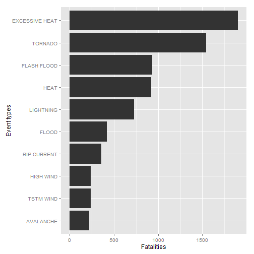
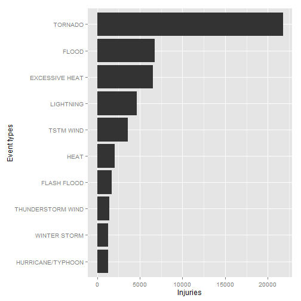
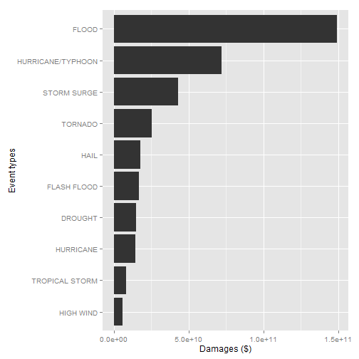

---
title: "Severe weather event consequence report"
output: 
  html_document:
    keep_md: true
--- 

## Synopsis

Storms and other severe weather events cause both public health and 
economic problems for communities and municipalities. This report is 
based on data from U.S. National Oceanic and Atmospheric 
Administration's (NOAA) storm database and lists weather events 
with most harmful effects on population health and with greatest 
economic consequences accross United States by using data collected 
through 1995-2011. Geographical variation of the weather events 
has not been studied in this report.

As described in the Report chapter, the most harmful weather events  
on population health across United States are excessive heat and 
tornado. These both are included in top 3 reasons for fatalities 
and injuries. Flash flood, flood, heat, lightning and tstm wind also
appear in top 10 reasons for both fatalities and injuries.

Weather events with greatest economic consequences 
considering both crop and property damages are flood, 
hurricane/typhoon and storm surge.

This document includes Data Processing chapter, which describes 
how the data was processed for analysis and Results chapter, which
presents the results of the analysis.


## Data processing

Data is processes for analysis in the following way

- Set locale and load required libraries
- Download source data
- Read source data
- Transform data
- Calculate harmful effects on population health
- Resolve events with greatest economic consequences

Each of these steps are decribed in their own chapters below.

### Set locale and load required libraries

Locale is set to English and required libraries are loaded.


```r
Sys.setlocale("LC_TIME", "English")
```

```
## [1] "English_United States.1252"
```

```r
library(ggplot2)
library(lubridate)
```

### Download source data

Source data is loaded if necessary. For this report, the data file was loaded
from http://d396qusza40orc.cloudfront.net/repdata%2Fdata%2FStormData.csv.bz2
at 12th Dec 2014 9:15 (GMT+3). The source data is in compressed bz2 format. 


```r
if( !file.exists("repdata-data-StormData.csv.bz2")) {
  if( !file.exists("repdata-data-StormData.csv.bz2")) {
    download.file("http://d396qusza40orc.cloudfront.net/repdata%2Fdata%2FStormData.csv.bz2", 
      	          "repdata-data-StormData.csv.bz2", 
      	          mode="wb")
	}
}
```

### Read source data

The data is in CSV-format and is read in.

National Weather Service provides some documentation about the source data, see
http://d396qusza40orc.cloudfront.net/repdata%2Fpeer2_doc%2Fpd01016005curr.pdf.


```r
datafile <- bzfile("repdata-data-StormData.csv.bz2", "r")
data <- read.csv(datafile)
close(datafile)
```

The events in the database start in the year 1950 and end in November 2011. 
There are 902297 rows in the dataset.

### Transform data

BGN_DATE column containing start date of the event. A new column YEAR is added
for indicating starting year of each event.


```r
data$YEAR <- as.numeric(gsub("^[0-9]+/[0-9]+/([0-9]+).*$","\\1", 
                             as.character(data$BGN_DATE)))
```

Tabel below lists total amount of events through years. 


```r
table(data$YEAR)
```

```
## 
##  1950  1951  1952  1953  1954  1955  1956  1957  1958  1959  1960  1961 
##   223   269   272   492   609  1413  1703  2184  2213  1813  1945  2246 
##  1962  1963  1964  1965  1966  1967  1968  1969  1970  1971  1972  1973 
##  2389  1968  2348  2855  2388  2688  3312  2926  3215  3471  2168  4463 
##  1974  1975  1976  1977  1978  1979  1980  1981  1982  1983  1984  1985 
##  5386  4975  3768  3728  3657  4279  6146  4517  7132  8322  7335  7979 
##  1986  1987  1988  1989  1990  1991  1992  1993  1994  1995  1996  1997 
##  8726  7367  7257 10410 10946 12522 13534 12607 20631 27970 32270 28680 
##  1998  1999  2000  2001  2002  2003  2004  2005  2006  2007  2008  2009 
## 38128 31289 34471 34962 36293 39752 39363 39184 44034 43289 55663 45817 
##  2010  2011 
## 48161 62174
```
In the earlier years of the database there are generally fewer events 
recorded, most likely due to a lack of good records. In our analysis, 
we use only data from 1995 onwards to overcome the issues caused by
varying data quality.


```r
data <- subset(data, data$YEAR >= 1995)
```

### Calculate harmful effects on population health

Harmful effects for population health are fatalities and injuries. Top 10
event types causing both fatalities and injuries are resolved.


```r
fatalities <- aggregate(data$FATALITIES, 
                        by=list(evtype=data$EVTYPE), 
                        FUN=sum)
fatalities <- fatalities[order(-fatalities$x), ]
fatalities <- fatalities[1:10,]
fatalities$evtype = with(fatalities, reorder(evtype, 10:1))

injuries <- aggregate(data$INJURIES, 
                      by=list(evtype=data$EVTYPE), 
                      FUN=sum)
injuries <- injuries[order(-injuries$x), ]
injuries <- injuries[1:10,]
injuries$evtype = with(injuries, reorder(evtype, 10:1))
```

### Resolve events with greatest economic consequences

Events with greatest economic consequences are resolved. Events cause
both crop and property damages, so damages are summed up.

In addition, each DMG column contains a numeric value and each 
DMGEXP column containg thousand multipliers for the numeric values. These
are converted into a numeric format.


```r
# combine PROPDMG and PROPDMGEXP
data$PROPDMGNUMBERS <- mapply(data$PROPDMG, data$PROPDMGEXP, FUN = function(value, multiplier) {
  if(toupper(multiplier) == "K") value * 1000
  else if(toupper(multiplier) == "M") value * 1000000
  else if(toupper(multiplier) == "B") value * 1000000000
  else value
}) 

# combine CROPDMG and CROPDMGEXP
data$CROPDMGNUMBERS <- mapply(data$CROPDMG, data$CROPDMGEXP, FUN = function(value, multiplier) {
  if(toupper(multiplier) == "K") value * 1000
  else if(toupper(multiplier) == "M") value * 1000000
  else if(toupper(multiplier) == "B") value * 1000000000
  else value
}) 

# combine PROP and CROP damages
damages <- aggregate(data$PROPDMGNUMBERS + data$CROPDMGNUMBERS, 
    	   by=list(evtype=data$EVTYPE), 
			   FUN=sum)
damages <- damages[order(-damages$x), ]
damages <- damages[1:10,]
damages$evtype = with(damages, reorder(evtype, 10:1))
```


## Results

The results are presented below in bar charts.

### Total fatalities by event type

Chart below decribes 10 event types with highest fatality numbers between 
1995-2011 accross United States.


```r
ggplot(fatalities, 
       aes(x = evtype, y = x)) +     
       xlab("Event types") +
       ylab("Fatalities") + 
       geom_bar(stat = "identity") + 
       coord_flip()
```

 

### Total injuries by event type

Chart below decribes 10 event types with highest injury numbers between 
1995-2011 accross United States


```r
ggplot(injuries, 
       aes(x = evtype, y = x)) +     
       xlab("Event types") +
       ylab("Injuries") + 
       geom_bar(stat = "identity") + 
       coord_flip()
```

 

### Total damages by event type

Chart below decribes 10 event types with highest caused damages between 
1995-2011 accross United States. Numbers include damages to both property 
and crop.


```r
ggplot(damages, 
       aes(x = evtype, y = x)) +     
       xlab("Event types") +
       ylab("Damages ($)") + 
       geom_bar(stat = "identity") + 
       coord_flip()
```

 
